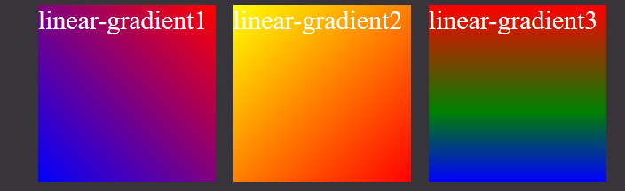
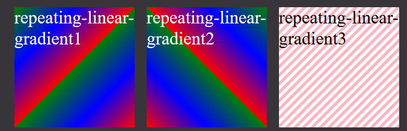
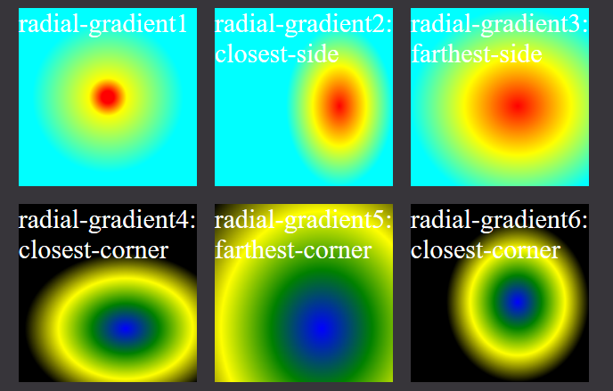
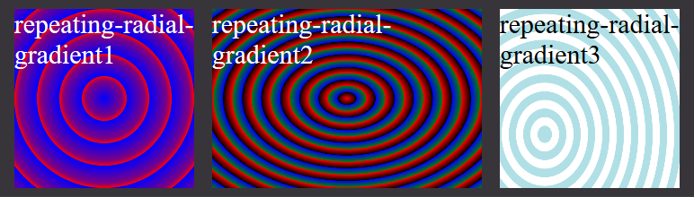
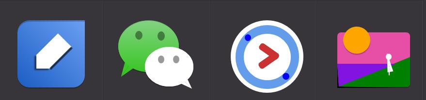

# 我的前端日志（二）

+ 作者：星腾  
+ 时间：2018/7/9 ~ 2018/7/12
+ 本文在[Github的地址](https://github.com/xingteng/Journals_in_DuoHuo/blob/master/002.Create%20icons%20with%20CSS/Create%20icons%20with%20CSS.md)
+ [CodePen预览地址](https://codepen.io/XingTeng/pen/bKXgvY)  
在此感谢您的阅读与指正

## 使用CSS制作图标
  

在网上看到了这样的案例就觉得惊讶，因为制作出的效果图标非常的具有质感，惊讶CSS也可以写出像图像软件做出的效果，很想知道它是如何实现的。所以，自己就试着去做了。  
我认为这里的图标设计如此传神，最重要的是色彩的搭配从而达到类似现实世界的阴影效果。
这里牵涉到了[CSS中的RGBA](https://developer.mozilla.org/zh-CN/docs/Web/CSS/color_value#rgba())这个知识点的理解。所以，特地去查看了[MDN中color的技术文档](https://developer.mozilla.org/zh-CN/docs/Web/CSS/color_value#概述)。  
## 一、颜色（color）
### （一）颜色概述
颜色的描述可以用以下的几种形式
+ 使用关键字
+ 使用RGB立体坐标（RGB cubic-coordinate）系统（以“#”加十六进制或者 rgb() 和 rgba() 函数表达式的形式）
+ 使用HSL圆柱坐标（HSL cylindrical-coordinate）系统（以 hsl() 和 hsla() 函数表达式的形式）
### （二）颜色取值
#### 1.使用关键字
1. 使用颜色关键字：不区分大小写的标识符，它表示一个具体的颜色，例如 red, blue, brown等使用名称来表述颜色
2. transparent关键字：表示一个完全透明的颜色，即该颜色看上去将是背景色。
3. currentcolor关键字：MDN上给出的关于这个关键字的介绍比较专业不是很容易理解，下面这篇文章对currentColor有着详细的介绍和使用方法[currentColor-CSS3超高校级好用CSS变量](https://www.zhangxinxu.com/wordpress/2014/10/currentcolor-css3-powerful-css-keyword/)。

#### 2.使用rgb()
(1). 十六进制符号 `#RRGGBB` 和 `#RGB` 
   + `#`后面跟6位/3位十六进制字符（0~9，A~F）。

(2). 函数符 rgb(R,G,B)
   + rgb后面跟3个整数值或者3个百分数
#### 3.使用hsl()
颜色也可以使用 `hsl()` 函数符被定义为色相-饱和度-明度（Hue-saturation-lightness）模式。 **色相（Hue）**表示色环（即代表彩虹的一个圆环）的一个角度。 这个角度作为一个无单位的 <number> 被给出。定义 red=0=360，其它颜色分散于圆环，所以 green=120, blue=240，以此类推。（同时隐含像 -120=240 和 480=120 这样的回环。）
饱和度和明度由百分数来表示。
100% 是满**饱和度**，而 0% 是一种灰度。
100% **明度**是白色， 0% 明度是黑色，而 50% 明度是*“一般的”*。
```css
hsl(0,  100%,50%)    /* red */   
hsl(240,100%,50%)    /* blue */
hsl(120,100%,25%)    /* dark green */
hsl(120,100%,50%)    /* green */
hsl(120,100%,75%)    /* light green */ 
hsl(120, 60%,70%)    /* pastel green */ 
```
#### 4.rgba()
颜色可以使用 rgba() 函数符在红-绿-蓝-阿尔法（RGBa）模式下被定义。它包含了阿尔法通道，允许设定一个颜色的透明度。0=透明；1=不透明；a的参数只可以在0到1之间。
#### 5.hsla()
就像rgba()对于rgb一样，hsla()增加了阿尔法通道，可以规定一个颜色的透明度。

----
## 二、新学习的CSS属性
### （一）transform-origin
transform-origin可以更改元素变形的原点。
```css
transform-origin: center; /*以元素的中心旋转*/
transform-origin: top left;/*以元素的左上角旋转*/
```
`transform-origin`属性可以使用一个，两个或三个值来指定，其中每个值都表示一个偏移量。 没有明确定义的偏移将重置为其对应的初始值。  
如果定义了两个或更多值并且没有值的关键字，或者唯一使用的关键字是center，则第一个值表示**水平偏移量**，第二个值表示**垂直偏移量**。
+  一个值：必须是距离尺寸`length`，百分数，或 left, center, right, top, bottom关键字中的一个。
+  两个值：其中一个必须是距离尺寸`length`，百分数，或`left`, `center`, `right`关键字中的一个。 另一个必须是距离尺寸`length`，百分数，或`top`, `center`, `bottom`关键字中的一个。
+ 三个值：前两个值和只有两个值时的用法相同。第三个值必须是`length`，它始终代表Z轴偏移量。  


### （二）linear-gradient()
+ [**CodePen预览地址**](https://codepen.io/XingTeng/pen/OwJKOg)  


  CSS **linear-gradient()** 函数用于创建一个表示两种或多种颜色线性渐变的图片。其结果属于[`gradient`](https://developer.mozilla.org/zh-CN/docs/Web/CSS/gradient)数据类型，是一种特别的[`image`](https://developer.mozilla.org/zh-CN/docs/Web/CSS/image)数据类型。
  所以由于`<gradient>`数据类型系`<image>`的子数据类型，`<gradient>`只能被用于`<image>`可以使用的地方，如`background`。因此，linear-gradient() 并不适用于background-color以及类似的使用` <color>`数据类型的属性中。
#### 语法
```css
linear-gradient([ [ [ <angle> | to [top | bottom] || [left | right] ],]? <color-stop>[, <color-stop>]+);
/*linear-gradient(角度/上下左右关键词，开始颜色，【中间颜色及位置，用百分数和像素表示，】结束颜色)*/
```

上图Gradient line即为渐变轴，上例中的`linear-gradient(45deg, blue, red);`,即是渐变轴顺时针旋转45度。渐变轴为0度时，其是竖直状态。
具体实例：
```css
linear-gradient(45deg, blue, red); /* 渐变轴为45度，从蓝色渐变到红色 */
linear-gradient(to left top, red, yellow);/* 从右下到左上、从蓝色渐变到红色 */
linear-gradient(0deg, blue, green 40%, red);
/* 渐变轴为0度，所以是从下到上，从蓝色开始渐变、到高度40%位置是绿色渐变开始、最后以红色结束 */
```

#### repeating-linear-gradient()
`repeating-linear-gradient()`是`linear-gradient()`的循坏渐变
###### 语法
```css
repeating-linear-gradient(angle | to side-or-corner, color-stop1, color-stop2, ...);
/*repeating-linear-gradient(角度 | 上下左右关键字 | 开始颜色， 结束颜色);*/
```

| 值Value                        | 描述                                  |
| ------------------------------ | ------------------------------------ |
| *angle*                        | 定义渐变的角度方向。从 0deg 到 360deg，默认为 180deg。       |
| *side-or-corner*               | 指定线性渐变的起始位置。由两个关键字组成：第一个为指定水平位置(left 或 right)，第二个为指定垂直位置（top 或bottom）。 顺序是随意的，每个关键字都是可选的。 |
| *color-stop1, color-stop2,...* | 指定渐变的起止颜色，由颜色值、**停止位置**（可选，使用百分比指定）组成。 |
具体实例
```css
.repeating-linear-gradient1 {
  background: repeating-linear-gradient(to top left,
      red, blue 25%, green 50%);
}
.repeating-linear-gradient2 {
  background: repeating-linear-gradient(45deg, red, blue 25%, green 50%); 
}
.repeating-linear-gradient3 {
  color: black;
  background: repeating-linear-gradient(to top left,
      lightpink, lightpink 5px, white 5px, white 10px);
}
```



### （三）radial-gradient()

+ [**CodePen预览地址**](https://codepen.io/XingTeng/pen/OwJKOg)  


CSS radial-gradient() 函数创建一个`<image>`，用来展示由原点（渐变中心）辐射开的颜色渐变。与其他渐变相同，CSS径向渐变不属于CSS `<color>`数据类型，而是一个不固定尺寸的图片，譬如，它没有默认尺寸、比例。具体尺寸由它所定义的元素尺寸决定。径向渐变(Radial gradients)由其中心点、边缘形状轮廓及位置、色值结束点（color stops）定义而成。  径向渐变的中心点至边缘形状以及其延伸的部分，由连续缩放的若干同心轮廓组成，这个轮廓由设定的边缘形状决定。色值结束点用于设定虚拟渐变射线（virtual gradient ray）的变化方式，由中心点水平变化至右侧（如图）。色值结束点由百分比设定时，则是相对于终点为渐变射线与边缘形状相交点的渐变半径，渐变半径的终点位置即为100%。每个轮廓均为纯色，颜色由渐变射线上相应横切点所定义的颜色决定。
#### 语法
```css
background: radial-gradient(shape size at position, start-color, ..., last-color);
```
值                                                                     | 描述 
-------------------------------------------------------------|---------------------------------------------------------
shape | ellipse (默认): 指定椭圆形的径向渐变。  circle ：指定圆形的径向渐变 
extent-keyword    | 关键字用于描述边缘轮廓的具体位置。以下为关键字常量 ：                                                  closest-side： 渐变的边缘形状与容器距离渐变中心点最近的一边相切（圆形）或者至少与距离渐变中心点最近的垂直和水平边相切（椭圆）。                                                                                 closest-corner：渐变的边缘形状与容器距离渐变中心点最近的一个角相交。                                                                                                                                      farthest-corner :  渐变的边缘形状与容器距离渐变中心点最远的一个角相交。                                                                                                   farthest-side：  与closest-side相反，边缘形状与容器距离渐变中心点最远的一边相切（或最远的垂直和水平边）。 
position | 定义渐变位置：center(默认)：设置中间为纵向渐变圆心的纵坐标值                                                                             top：设置顶部为径向渐变圆心的纵坐标值。                                                                                     bottom：设置底部为径向渐变圆心的纵坐标值。 

具体实例(含图片)
```css
.radial-gradient1 {
  background: radial-gradient(circle, red 5%, yellow 15%, cyan 60%);
  /*颜色结点不均匀分布的径向渐变*/
}
.radial-gradient2 {
  background: radial-gradient(closest-side at 70% 55%, red, yellow, cyan);
}
.radial-gradient3 {
  background: radial-gradient(farthest-side at 60% 55%, red, yellow, cyan);
}
.radial-gradient4 {
  background: radial-gradient(closest-corner at 60% 70%, blue, green, yellow, black);
}
.radial-gradient5 {
  background: radial-gradient(farthest-corner at 60% 70%, blue, green, yellow, black);
}
.radial-gradient6 {
  /*另外一种写法*/
  background: -webkit-radial-gradient(60% 55%, closest-side, blue, green, yellow, black); /* Safari 5.1 - 6.0 */
  background: -o-radial-gradient(60% 55%, closest-side, blue, green, yellow, black); /* Opera 11.6 - 12.0 */
  background: -moz-radial-gradient(60% 55%, closest-side, blue, green, yellow, black); /* Firefox 3.6 - 15 */
  background: radial-gradient(60% 55%, closest-side, blue, green, yellow, black); /* 标准的语法（必须放在最后） */
}
```


#### repeating-radial-gradient()
`repeating-radial-gradient()`是`radial-gradient()`的循坏渐变

#### 语法 

```css
repeating-radial-gradient( 
       [[ circle  || <length> ]                     [at <position>]? , | 
        [ ellipse || [<length> | <percentage> ]{2}] [at <position>]? , |
        [[ circle | ellipse ] || <extent-keyword> ] [at <position>]? , |
                                                     at <position>   ,    <color-stop> [ , <color-stop> ]+ )
  /*repeating-radial-gradient (
    circle或者ellipse <length> | <extent-keyword>:closest-side等等 |颜色及结束位置 )*/
```
具体实例（含图片）
```css
.repeating-radial-gradient1 {
  background: repeating-radial-gradient(circle 100px, blue, purple 20%, red 25%);
}
.repeating-radial-gradient2 {
  width: 300px;
  background: repeating-radial-gradient(ellipse farthest-corner, red, black 5%, blue 5%, green 10%);
}
.repeating-radial-gradient3 {
  color: black;
  background: repeating-radial-gradient(closest-side at 25% 70%, powderblue, powderblue 8px, white 8px, white 16px);
}
```


## 三、自己动手做图标
为了对文章开头["不可错过的16个纯CSS3动画小图标"](https://www.html5tricks.com/16-pure-css3-icon.html)中的代码更好理解，在练习了html5tricks一些的CSS3动画图标之后，自己动手制作了一些新的图标，这些图标都是来自手机app的logo：有道云笔记，微信，优酷，Fabulous。

这是[CodePen预览的地址](https://codepen.io/XingTeng/pen/bKXgvY)，还会持续更新。


#### 参考资料
1. 作者html5tricks.[不可错过的16个纯CSS3动画小图标](https://www.html5tricks.com/16-pure-css3-icon.html)
2. MDN.[CSS Color](https://developer.mozilla.org/zh-CN/docs/Web/CSS/color_value#概述)
3. MDN.[CSS gradient](https://developer.mozilla.org/zh-CN/docs/Web/CSS/gradient)
