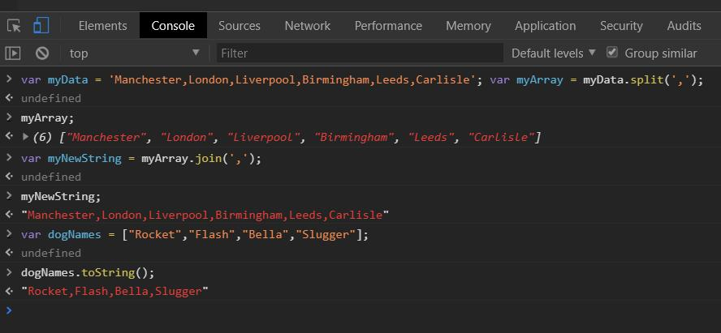
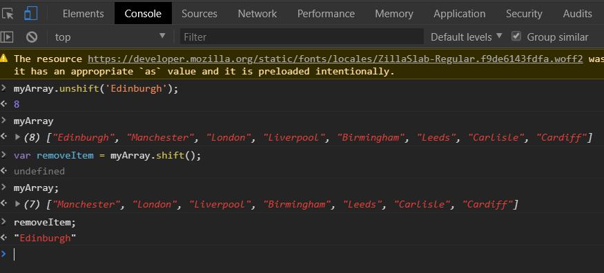

# 前端日志（三） JavaScript第一步-MDN
+ 作者：星腾（前端组） 
+ 时间：2018/718 - 7/22
## 一、什么是JavaScript？
JavaScript 是一种脚本或者说编程语言，它允许你在网页上实现复杂的功能 —— 每次当你浏览网页时不只是显示静态信息—— 显示即时更新的内容， 或者交互式的地图，或 2D/3D 图形动画，又或者自动播放视频等。
## 二、数据类型和变量
变量是用来存储数值的，那么有一个重要的概念需要区分。变量不是数值本身，它们仅仅是一个用于存储数值的容器。你可以把变量想象成一个个用来装东西的纸箱子。
### 声明变量
```js
var myName；
var myAge；
```
### 初始化变量

```js
myName = 'Chris';
myAge = 37;
```
### 更新变量
关于变量命名的规则

你可以给你的变量赋任何你喜欢的名字，但有一些限制。 一般你应当坚持使用拉丁字符(0-9,a-z,A-Z)和下划线字符。
+ 你不应当使用规则之外的其他字符，因为它们可能引发错误，或对国际用户来说难以理解。
+ 变量名不要以下划线开头—— 以下划线开头的被某些JavaScript设计为特殊的含义，因此可能让人迷惑。
+ 变量名不要以数字开头。这种行为是不被允许的，并且将引发一个错误。
+ 一个可靠的命名约定叫做["小写驼峰命名法"](https://en.wikipedia.org/wiki/CamelCase#Variations_and_synonyms)，用来将多个单词组在一起，小写整个命名的第一个字母然后大写剩下单词的首字符。我们已经在文章中使用了这种命名方法。
+ 让变量名直观，它们描述了所包含的数据。不要只使用单一的字母/数字，或者长句。
+ 变量名大小写敏感——因此myage与myAge是2个不同的变量。
+ 最后也是最重要的一点—— 你应当*避免*使用**JavaScript的保留字**给变量命名。保留字，即是组成JavaScript的实际语法的单词！因此诸如 var, function, let和for等，都不能被作为变量名使用。浏览器将把它们识别为不同的代码项，因此你将得到错误。

### 变量类型
#### Number
你可以在变量中存储数字，不论这些数字是像30（也叫整数）这样，或者像2.456这样的小数（也叫做浮点数）。与其他编程语言不同，在JavaScript中你不需要声明一个变量的类型。当你给一个变量数字赋值时，不需要用引号括起来。
```js
var myAge = 19;
```
#### String
字符串是文本的一部分。当你给一个变量赋值为字符串时，你需要用单引号或者双引号把值给包起来，否则JavaScript将会把这个字符串值理解成别的变量名。

```js
var dolphinGoodbye = 'So long and thanks for all the fish';
```
#### Boolean(布尔值)
Boolean 的值有2种：true或false。它们通常被用于在适当的代码之后，测试条件是否成立。举个例子，一个简单的示例如下： 

```js
var iAmAlive = true;
```
然而实际上通常是以下用法：
```js
var test = 6 < 3;
```
这是使用“小于”操作符（<）来测试6小于3。正如你所料的，将会返回false，因为6并不小于3！

#### Array
数组是一个单个对象，其中包含很多值，方括号括起来，并用逗号分隔。尝试在您的控制台输入以下行:
```js
var myNameArray = ['Chris', 'Bob', 'Jim'];
var myNumberArray = [10,15,40];
```
当数组被定义后，您可以使用如下所示的语法来访问各自的值，例如下行:

```js
myNameArray[0]; // should return 'Chris'
myNumberArray[2]; // should return 40
```

#### Object
在编程中，对象是现实生活中的模型的一种代码结构。您可以有一个简单的对象，代表一个停车场，并包含有关其宽度和长度的信息，或者您可以有一个代表一个人的对象，并包含有关他们的名字，身高，体重，他们说什么语言，如何说 你好，他们，等等。
尝试在您的控制台输入以下行:

```js
var dog = { name : 'Spot', breed : 'Dalmatian' };
```
要检索存储在对象中的信息，可以使用以下语法:
```js
dog.name
```
### 动态类型
avaScript是一种“动态类型语言”，这意味着不同于其他一些语言(译者注：如C、JAVA)，您不需要指定变量将包含什么数据类型（例如number或string）

例如，如果你声明一个变量并给它一个带引号的值，浏览器就会知道它是一个字符串。即使它包含数字，但它仍然是一个字符串，所以要小心：
```js
var myNumber = '500'; // oops, this is still a string
typeof myNumber;
myNumber = 500; // much better — now this is a number
typeof myNumber
```
使用了一个名为typeof()的特殊函数——它会返回所传递给它的变量的数据类型。
第一次在上面的代码中调用它，它应该返回string，因为此时myNumber变量包含一个字符串'500'。 

## 三、数字和操作符
### 数字类型
+ 整数
+ 浮点数
+ 双精度 ：一种特定类型的浮点数，它们具有比标准浮点数更高的精度（这意味着它们精确到更大的小数位数）。
不同类型的数字系统：
+ 二进制
+ 八进制
+ 十六进制 - 基数16，每列使用0-9，然后使用a-f。 在CSS中设置颜色时，可能会遇到这些数字。

与其他一些编程语言不同，JavaScript只有一个数据类型，您猜测到，Number。这意味着，你在JavaScript中处理的任何类型的数字，都以完全相同的方式处理它们。  

在控制台中声明一对变量
```js
var myInt = 5;
var myFloat = 6.667;
myInt;
myFloat;
```
使用typeof查看变量类型
```js
typeof myInt;
typeof myFloat;
```
发现返回“ number”

### null和underfined
null表示一个“空”的值，它和0以及空字符串''不同，0是一个数值，''表示长度为0的字符串，而null表示“空”。

在其他语言中，也有类似JavaScript的null的表示，例如Java也用null，Swift用nil，Python用None表示。但是，在JavaScript中，还有一个和null类似的undefined，它表示“未定义”。

JavaScript的设计者希望用null表示一个空的值，而undefined表示值未定义。大多数情况下，我们都应该用null。undefined仅仅在判断函数参数是否传递的情况下有用。

### 算数运算符

运算符 | 名称 |	作用 | 示例
---|---|---|---
+ |	加法 |	两个数相加。 |	6 + 9
- |	减法 |	从左边减去右边的数。 |	20 - 15
* |	乘法 |	两个数相乘。 |	3 * 7
/ |	除法 |	用右边的数除左边的数 |	10 / 5
% |	求余(有时候也叫取模) 	

在你将左边的数分成同右边数字相同的若干整数部分后，返回剩下的余数
	8 % 3 (返回 2，将8分成3份，余下2 。)

#### 运算符优先级
操作员类型|	个体算子
--|--
member |	. []
呼叫/创建实例call / create instance |	() new
否定/增量 |	! ~ - + ++ -- typeof void delete
乘法/除法 |	* / %
加减 |	+ -
按位移位 |	<< >> >>>
关系 |	< <= > >= in instanceof
平等 |	== != === !==
按位-和 |	&
按位异或 |	^
按位或 	|  `|`
逻辑-和 |	&&
逻辑-或 |  `||`
有条件的 |	?:
分配 |	= += -= *= /= %= <<= >>= >>>= &= ^= |=
逗号 |	,

### 递增和递减运算符
使用增量（++）和递减（ - ）运算符来完成。
### 操作运算符

运算符 | 名称 |	作用 |	示例 |	等价于
--|--|--|--|--
+= | 递增赋值 |	右边的数值加上左边的变量，然后再返回新的变量。|	x = 3; x += 4; |	x = 3;x = x + 4;
-= | 递减赋值|左边的变量减去右边的数值，然后再返回新的变量。|	x = 6;x -= 3; | x = 6;x = x - 3; 
*= |	乘法赋值 |	左边的变量乘以右边的数值，然后再返回新的变量。| x = 2;|x *= 3; 	x = 2;x = x * 3;
/= 	| 除法赋值 |	左边的变量除以右边的数值，然后再返回新的变量。| 	x = 10;x /= 5; |	x = 10;x = x / 5;

### 比较运算符
有时，我们将要运行真/假测试，然后根据该测试的结果进行相应的操作 - 为此，我们使用比较运算符。
运算符 |	名称 |	作用 |	示例
--|--|--|--
=== |	严格等于 |	测试左右值是否相同 |	5 === 2 + 4
!== |	严格不等于 | 测试左右值是否相同 |	5 !== 2 + 3
< |	小于 |	测试左值是否小于右值。 |	10 < 6
> |	大于 |	测试左值是否大于右值 |	10 > 20
<=|小于或等于 |	测试左值是否小于或等于右值。 |3 <= 2
>= |大于或等于 |测试左值是否大于或等于正确值。|5 >= 4

Note: 您可能会看到有些人在他们的代码中使用`==`和`!=`来平等和不相等，这些都是JavaScript中的有效运算符，但它们与`===`/`!==`不同，前者测试值是否相同， 但是数据类型可能不同，而后者的严格版本测试值和数据类型是否相同。 严格的版本往往导致更少的错误，所以我们建议您使用这些严格的版本。

## 四、Javascript中的字符串

1创建字符串
```js
var s = 'hello, world';
```
2单引号和双引号
不能在字符串中包含相同的引号，因为它是用来包含它们的。下面将会出现错误，因为它会混淆浏览器和字符串的结束位置:
```js
var bigmouth = 'I've got no right to take my place...';
```
### 转义字符
在JavaScript中，我们通过在字符之前放一个反斜杠来实现这一点。
```js
var bigmouth = 'I\'ve got no right to take my place...';
bigmouth;
```
更多细节请参见[转义符号](https://developer.mozilla.org/en-US/docs/Web/JavaScript/Reference/Global_Objects/String#Escape_notation)。
### 连接字符串
要把多个字符串连接起来，可以用+号连接：
```js
var name = '小明';
var age = 20;
var message = '你好, ' + name + ', 你今年' + age + '岁了!';
alert(message);
```

如果有很多变量需要连接，用+号就比较麻烦。ES6新增了一种模板字符串，表示方法和上面的多行字符串一样，但是它会自动替换字符串中的变量：
```js
var name = '小明';
var age = 20;
var message = `你好, ${name}, 你今年${age}岁了!`;
alert(message);
```
### 数字与字符

 如果您有一个数值变量，您想要将其转换为字符串，但不改变其他方式，或者您想要转换为一个数字而不改变的字符串变量，那么您可以使用以下两个构造:

如果可以的话，Number对象将把传递给它的任何东西转换成一个数字。试一试:
```js
    var myString = '123';
    var myNum = Number(myString);
    typeof myNum;
```

另一方面，每个数字都可以用一个名为 toString() 的方法，它将把它转换成等价的字符串。
试试这个:
```js
var myNum = 123;
var myString = myNum.toString();
typeof myString;
```
这些结构可以在某些情况下非常有用,例如,如果一个用户输入一个十进制的数字转换成一种文本字段,这将是一个字符串,但是如果你想将它添加到说的东西,你会需要一个数字,所以你可以通过` Number()`来处理这个问题。

## 五、处理字符串方法
### 获得字符串的长度
```js
var browserType = 'mozilla';
browserType.length;
```
### 检索特定字符串字符
要检索任何字符串的最后一个字符，我们可以使用以下行
```js
browserType[browserType.length-1];
```
### 在字符串中查找子字符串并提取它

有时候你会发现一个较大的字符串是否存在于一个较大的字符串中（我们通常会说一个字符串中存在一个子字符串）。 这可以使用indexOf()方法来完成，该方法需要一个parameter  你想要的子字符串 搜索。 尝试这个：
```js
browserType.indexOf('zilla');
```

 这给了我们2的结果，因为子串“zilla”从“mozilla”内的位置2（0，1，2 - 所以3个字符）开始。 这样的代码可以用来过滤字符串。 例如，假设我们有一个Web地址列表，只想打印出包含“mozilla”的那些。
 这可以以另一种方式完成，这可能更有效。 尝试以下：
```javascript
browserType.indexOf('vanilla');
```

他应该给你一个结果-1 - 当在主字符串中找不到子字符串（在本例中为“vanilla”）时返回。您可以使用它来查找不包含子串“mozilla”的所有字符串实例，或者如果使用否定运算符，请执行以下操作。 你可以这样做：

```js
if(browserType.indexOf('mozilla') !== -1) {

  // do stuff with the string

}
```

当你知道字符串中的子字符串开始的位置，以及想要结束的字符时，slice()可以用来提取它。 尝试以下：

```js
browserType.slice(0,3);
```

这时返回"moz"——第一个参数是开始提取的字符位置，第二个参数是提取的最后一个字符后一位置。所以提取从第一个位置开始，直到但不包括最后一个位置。（此例中）你也可以说第二个参数等于被返回的字符串的长度。

此外，如果您知道要在某个字符之后提取字符串中的所有剩余字符，则不必包含第二个参数，而只需要包含要从中提取的字符位置 字符串中的其余字符。 尝试以下：

```js
browserType.slice(2);
```
这返回“zilla” - 这是因为2的字符位置是字母z，并且因为没有包含第二个参数，所以返回的子字符串是字符串中的所有剩余字符。

### 转换大小写
```js
var radData = 'My NaMe Is MuD';
radData.toLowerCase();
radData.toUpperCase();
```
### 替换字符串的某部分
```js
browserType.replace('moz','van');
```
**注意**，想要真正更新browserType变量的值反应在真实程序里，您需要设置变量的值等于刚才的操作结果；它不会自动更新子串的值。所以事实上你需要这样写：
```js
browserType = browserType.replace('moz','van');。
```
**字符串方法的参数不必是字符串文字; 它们也可以是变量，甚至是在其上调用方法的变量。**

#### JS实际运用案例
**1把错误的大小写修改**
```js
var cities = ['lonDon', 'ManCHESTer', 'BiRmiNGHAM', 'liVERpoOL'];
var input = cities[i];
var lower = input.toLowerCase();
var first = lower.slice(0, 1);
var lower = lower.replace(first, first.toUpperCase());
```
**2从原先部分得到新字符串**
一堆字符串，其中包含有关英格兰北部火车站的信息。 字符串是包含三字母站代码的数据项，后面是一些机器可读数据，后跟分号，后跟可读站名。 例如：
```js
MAN675847583748sjt567654;Manchester Piccadilly
```
我们要提取站点代码和名称，并将它们放在一起，具有以下结构的字符串：
```js
MAN: Manchester Piccadilly
```

```js
for(var i = 0; i < stations.length; i++) {
  var input = stations[i];
  // write your code just below here
  var gender = input.slice(0,3);
  var newStations = input.indexOf(';');
  var name = input.slice(newStations + 1);
  var add = gender + ': ' + name;
  var result = add;
}
```

## 六、数组
### 什么是数组？
数组——一种将一组数据存储在单个变量名下的优雅方式。
（基本上是包含存储在列表中的多个值的单个对象。）
### 创建数组
可以将数组中的任何项目存储在数组中-字符串，数字，对象，另一个变量，甚至另一个数组。 您也可以混合和匹配项目类型 - 它们并不都是数字，字符串等。尝试这些：
```js
var sequence = [1, 1, 2, 3, 5, 8, 13];
var random = ['tree', 795, [0, 1, 2]];
```
### 访问和修改数组
```js
sequence[0]; //访问
sequence[0] = 'new'; //修改
sequence;
```
#### 多维数组
数组中的数组称为多维数组。可以通过将两组方括号链接在一起来访问数组内的另一个数组。
```js
random[2][2];
```
### 查找数组长度
```js
var sequence = [1, 1, 2, 3, 5, 8, 13];
sequence.length;
//用途，但最常用来告诉循环，直到它循环遍历数组中的所有项。
for (var i = 0; i < sequence.length; i++) {
  console.log(sequence[i]);
}
```
代码：
1. 在数组中的项目编号0开始循环。
2. 停止在项目编号等于数组长度的循环。 
这将适用于任何长度的数组，但在这种情况下，它将停止在项目编号7的循环（这是好的，因为最后一个项目 - 我们希望循环覆盖 - 是6。
3. 对于每个项目，使用console.log（）将其打印到浏览器控制台。

### 数组方法
#### 字符串和数组之间转换

```js
var myData = 'Manchester,London,Liverpool,Birmingham,Leeds,Carlisle';//创建字符串
var myArray = myData.split(',');//用逗号分隔
myArray;
//找到新数组的长度，并从中检索一些项目：
myArray.length;
myArray[0]; // the first item in the array
myArray[1]; // the second item in the array
myArray[myArray.length-1]; // the last item in the array
//使用join()方法进行相反的操作。 尝试以下：
var myNewString = myArray.join(',');
myNewString;
//另一种方法是使用toString()方法。 toString（）可以比join（）更简单，因为它不需要一个参数，但更有限制。
//使用join（）可以指定不同的分隔符（尝试使用与逗号不同的字符运行步骤4）。
var dogNames = ["Rocket","Flash","Bella","Slugger"];
dogNames.toString(); //Rocket,Flash,Bella,Slugger
```

### 添加和删除数组
数组末尾添加或删除一个项目，我们可以使用push()和pop()。
```js
myArray.push('Cardiff');
//当方法调用完成时，将返回数组的新长度。 如果要将新数组长度存储在变量中，可以执行以下操作：
var newLength = myArray.push('Cardiff');
myArray;
newLength;
myArray.pop(); //删除数组最后一个项目
```
unshift()和shift()以完全相同的方式工作，只是它们分别作用于数组的开始处，而不是结尾处。
首先unshift() — 尝试一下命令
```js
myArray.unshift('Edinburgh');
myArray;
```
现在shift（）; 尝试这些！
```js
var removedItem = myArray.shift();
myArray;
removedItem;
```


---
### 参考文献

+ [JavaScript第一步](https://developer.mozilla.org/zh-CN/docs/Learn/JavaScript/First_steps)