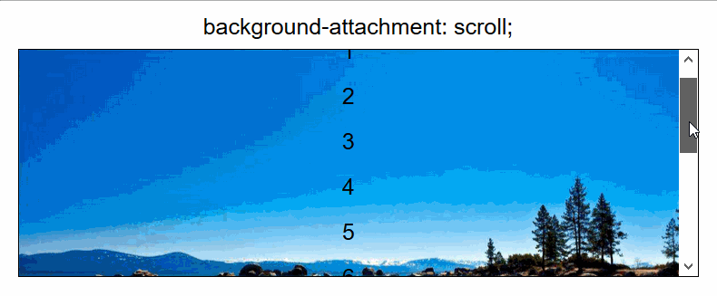
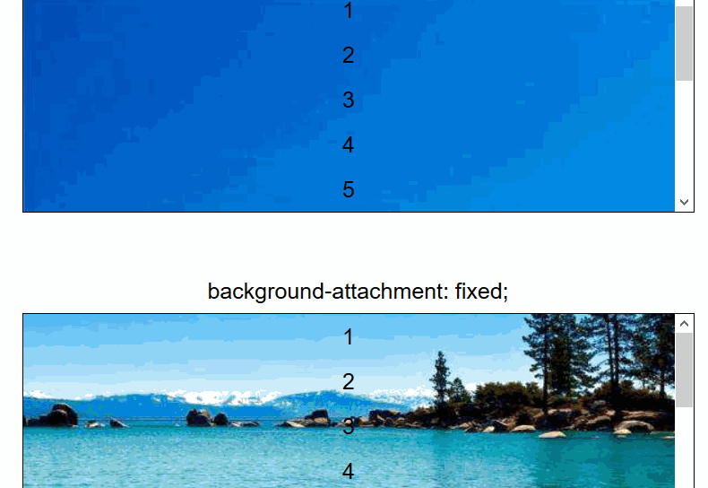

# 前端日志（五）

+ 作者：星腾（前端组）
+ 时间：2018/8/10 - 8/12

# 视差滚动学习 - Parallax Scrolling
视差滚动（Parallax Scrolling）是指让多层背景以不同的速度移动，形成立体的运动效果，带来非常出色的视觉体验。我们先看看网页效果是啥样？


通常而言，这样的效果需要辅助JavaScript来实现，但是单纯使用CSS也是可以达到相似的效果。

## 了解[background-attachment](https://developer.mozilla.org/zh-CN/docs/Web/CSS/background-attachment)-MDN

如果指定了 [`background-image`](https://developer.mozilla.org/zh-CN/docs/Web/CSS/background-image) ，那么 [`background-attachment`](https://developer.mozilla.org/zh-CN/docs/Web/CSS/background-attachment) 决定背景是在视口中固定的还是随包含它的区块滚动的。 

| [初始值](https://developer.mozilla.org/zh-CN/docs/Web/CSS/initial_value) | `scroll`                                                     |
| ------------------------------------------------------------ | ------------------------------------------------------------ |
| 适用元素                                                     | all elements. It also applies to [`::first-letter`](https://developer.mozilla.org/zh-CN/docs/Web/CSS/::first-letter) and [`::first-line`](https://developer.mozilla.org/zh-CN/docs/Web/CSS/::first-line). |

## 语法

```css
background-attachment: scroll;
background-attachment: fixed;
background-attachment: local;
background-attachment: inherit;
```

## 取值

- `scroll`

  此关键字表示背景相对于<u>元素**本身**</u>固定， 而不是随着它的内容滚动（对元素边框是有效的）。

- `local`

  此关键字表示背景相对于<u>元素的**内容**</u>固定。如果一个元素拥有滚动机制，背景将会随着元素的内容滚动， 并且背景的绘制区域和定位区域是相对于可滚动的区域而不是包含他们的边框。

- `fixed`

  此关键字表示背景相对于**<u>视口</u>**固定。即使一个元素拥有滚动机制，背景也不会随着元素的内容滚动。

单纯地看定义，可能还是比较空洞😶，我们还是来点例子吧。

DEMO: 也可参考[CodePen的Demo地址](https://codepen.io/XingTeng/pen/gjEgYV)
`background-attachment: scroll; `

相对于<u>元素**本身**</u>固定， 而不随内容滚动。

`background-attachment: local; `


相对于<u>元素的**内容**</u>固定，有时也会随着内容滚动。这种效果是我们常见的效果。 

`background-attachment: fixed; `


好了，精彩的来了，请注意观察上面的GIF，首先是元素内容外的上下滚动，我们发现图片的位置没有变。让我们产生视差的是那个上下滚动的长方形区域，也就是上文中的“视口”那个东西，所以上文定义说：

> 此关键字表示背景相对于**<u>视口</u>**固定。

继续观察GIF，我们发现：当我们用鼠标拖动元素的滚动条的时候，内容滚动，但是背景没有滚动！所以对应上文的：

> 即使一个元素拥有滚动机制，背景也不会随着元素的内容滚动。

下面我们上代码

HTML:

```html
    <section class="pic1">IMG1</section>
    <section class="pic2">IMG2</section>
    <section class="pic3">IMG3</section>
```

CSS:

```css
section {
	height: 100vh;
    background-attachment: fixed;
    background-size: cover;
    background-position: center center;
}

.pic1 {
    background-image: url(Hippopx.jpg); 
}
.pic2 {
    background-image: url(Hippopx3.jpg);
}
.pic3 {
    background-image: url(Hippopx5.jpg);
}
```

效果


也许你已经看到上方CSS代码第二行的length单位，我们采用了vh。这是视区的相关单位。可以参照张旭鑫的这篇[视区相关单位vw, vh..简介以及可实际应用场景](https://www.zhangxinxu.com/wordpress/2012/09/new-viewport-relative-units-vw-vh-vm-vmin/)，进行更深了解。


---

参考链接：[滚动视差？CSS不在话下](https://mp.weixin.qq.com/s?__biz=MzAxODE2MjM1MA==&mid=2651554736&idx=1&sn=d03f46c356ebc57c53863736df575865&chksm=80255471b752dd67673c9839be7c2dad9cca488dcd6c6992acf9b0729c72dc73fbf678c4387b&mpshare=1&scene=23&srcid=0813PicYYeRUhDLnhsgOlqdn#rd)