# 我的前端日志（一）
+ 作者：洪鑫   
+ 时间：2018-07-02 ~ 07-06  
+ 本文在[GitHub的地址](https://github.com/xingteng/Journals_in_DuoHuo/edit/master/To%20draw%20triangles%20with%20CSS/To%20draw%20triangles%20with%20CSS.md)  
+ 部分代码效果可以[在CodePen地址上预览](https://codepen.io/XingTeng/pen/PavLQE?editors=1100)  
我接触前端时间不长，这也是我第一次写这样的日志，内容中还有许多不完善的地方,在此感谢您的阅读与指正。
## 箭头菜单 —— 鼠标移动列表上时自动添加左右两个箭头（不使用插入图片的形式）
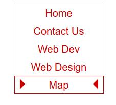

---
第一步：  
设置HTML结构  
首先安放一个```<div>```标签，（其id属性设置为menu），用于包含整个菜单。  
第二步：  
在div中，加入若干个链接标签，由于这里篇幅有限，所以我们只用了两个作为举例。（链接名称为Home, Contact Us）  
第三步：  
在链接标签内部，加入两个span标签，这里的span在后面将会承担类似“钩子”的作用，用于三角形安放。
```html
<div id="menu">
    <a href="#">
        <span class="left"></span> <!--设置span为钩子 -->
        Home
        <span class="right"></span>
    </a>
    <a href="#">
        <span class="left"></span>
        Contact Us
        <span class="right"></span>
    </a>
    ···
</div>
```

第四步:对菜单和内部的链接的样式进行设置。
```css
#menu {
    font-family: Arial;
    font-size: 16px;
    width: 140px;    /* 设置好合适的宽度*/
    margin: 0 auto; 
    border: 1px solid #ccc;
}
#menu a, #menu a:visited {
    position: relative;  /* 相对定位*/
    text-decoration: none;
    text-align: center;
    color: #c00;
    display: block; /*显示为块级元素*/
    padding: 4px;
    background-color: #fff;
    border: 1px solid #fff;/*更换与背景相同的背景色，防止产生跳动*/
}
```
第五步：
设置span的样式  
1.使用绝对定位，top:4px使span往下移动4px的距离  
2.把其高度和宽度设置为0，
把其边框的宽度加大，设置为8px；span为块级元素  
3.链接左右两边各放置一个箭头，左边的箭头要把边框的左边部分，改为红色。右边的箭头要把边框的右边部分，改为红色。
```css
#menu a:hover span {
    position: absolute;
    top: 4px;     /* 与上方的padding对应*/
    height: 0;
    width: 0;
    overflow: hidden;   /* 防止溢出*/ 
    border: 8px solid #fff;   /*加大边框的宽度，同时与背景色相同*/
    display: block;    /*设置为块级元素 */
}
#menu a:hover span.left {
    border-left-color: #c00;
    left: 8px;  /* 使其位置更靠近链接内容*/
}
#menu a:hover span.right {
    border-right-color: #c00;
    right: 8px;
}
```

至此我们的代码已经完成。

---
### 实现方法分析：
如果我们把代码改成下面会如何？  
```css
#menu a:hover span {
    position: absolute;
    top: 4px;     /* 与上方的padding对应*/
    height: 0;
    width: 0;
    overflow: hidden;   /* 防止溢出*/ 
    border: 8px solid #fff;   /*加大边框的宽度，同时与背景色相同*/
    display: block;    /*设置为块级元素 */
}
#menu a:hover span.left {
    border-left-color: #c00;
    border-top-color: blue;
    border-right-color: green;
    border-bottom-color: yellow;
    left: 8px;  /* 使其位置更靠近链接内容*/
}
#menu a:hover span.right {
    border-right-color: #c00;
    right: 8px;
}
```

#### 左边的箭头变成了彩色
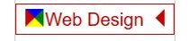  
当鼠标移动到链接上时，左边的三角形变成了一个彩色的正方形！  
原因：因为之前已经把高度和宽度设为0，同时span里面没有内容，所以我们看到的正方形只是边框而已。又因为边框被我们设置的太粗，所以看起来好像一个正方形。  
正方形被分成了上下左右四个部分，所以当正方形的左边设为红色，上下右被设置成同背景白色相同，从视觉上看就像三角形一样。  
总结：设置一个没有内容的```<span>```标签，然后把它的边框设置的非常粗，然后把左边或者右边的颜色设置的与背景色不同，然后再把这些块级元素,像钩子一样挂在菜单上。
### 为什么要用这个css属性？
代码中使用了:hover选择器。这使得我们在不用Javascript的情况下，就可以实现鼠标停留在链接上，三角形自动出现。

## 其他办法：
### 不用多余的html标签，使用css 的before 和after伪元素实现同样效果。
一、首先，设置HTML结构。这次只是单纯地放置链接标签，同时设置好class属性。
```html
<a href="#" class="arrow">
    Home
</a>
<a href="#" class="arrow">
    Contact Us
</a>
<a href="#" class="arrow">
    Web Dev
</a>
```

二、同样设置好arrow基本的属性。
相对定位，
宽度180px，
外边距为0，
以块级显示，
文本居中，
背景为白色，
上下内边距为2px。
```css
.arrow {
    position: relative;
    width: 180px;
    margin: 0 auto;
    display: block;
    text-align: center;
    background-color: #fff;
    padding: 2px 0 2px 0;
}
.arrow:hover {
    border: 1px solid blue;
}
```

三、设置befor和after伪元素的样式：  
绝对定位，
宽度高度都为0，
边框加粗为10px，
内容无，
在未显示时，伪元素会遮住一部分文字，所以统一设置为向左移动9px。
设置 :hover 使得before和after在鼠标浮动在链接上，箭头出现。颜色设置为蓝色。
```css
.arrow::after, .arrow::before {
    position: absolute;
    width: 0;
    height: 0;
    border: 10px solid #fff;
    content: "";
    right: 9px;
}
.arrow:hover::after {
    right: 9px;
    border-right-color: blue;
}
.arrow:hover::before {
    left: 9px;
    border-left-color: blue;
}
```

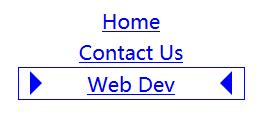  *效果如图*
# 三角形的其他应用
## 用三角形制作五角星
一、HTML结构　　
```html
<div class="box">
    <div class="triangle"></div>
</div>
```

二、CSS中的box样式，用于五角星外的“包装”
```css
.box {
    position: relative;
    top: 100px;
    left: 100px;
}
```

三、制作一个三角形  
还是按照我们之前的方法来进行操作  
```css
.triangle {
    width: 0;
    height: 0;
    border-color: #21BBFE transparent transparent transparent;
    border-style: solid;
    border-top-width: 27px; /* 注意这里的宽度有差异*/
    border-right-width: 40px;
    border-left-width: 40px;
    content: "";
    position: relative;
}
```

transparent属性使得边框为透明。
此外，与以往不同的地方在于我们对border-top-width，也就是上边框的宽度进行了差异化处理（宽度变小了），而左右边框的宽度相等，这样使得我们的三角形为等腰三角形，同时腰长增加（高变短了）。  
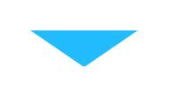

四、使用伪元素复制出2个相同的三角形  
```css
.triangle:before, 
.triangle:after {
    width: 0;
    height: 0;
    border-color: #fd4 transparent transparent transparent;
    border-style: solid;
    border-top-width: 27px;
    border-right-width: 40px;
    border-left-width: 40px;
    content: "";
    display: block;
    position: absolute;
    top: -27px;
    left: -40px;
}
```

对于这两个复制的三角形，使用绝对定位，此时它们的位置恰好与原先的三角形重合。  
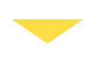  
五、调整“已复制”三角形的角度
```css
.triangle:before {
    transform: rotate(70deg);
}
.triangle:after {
    transform: rotate(-70deg);
}
```
对2个伪元素使用transform属性，rotate(70deg)为顺时针旋转70度，rotate(-70deg)为逆时针旋转70度。  
需要注意的是：左右下边框被我们设置成了透明的，所以显示在页面中的是上边框，旋转时自然以下顶点为基准。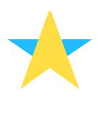 

---
## 气泡对话框  
一、HTML结构如下
```html
<div class="box">
    <div class="t-box"></div>
</div>
```

二、引入伪元素  
思路：把::before伪元素设计为一个正方形，顺时针旋转45度。把t-box设置为一个长方形，盖住正方形的右半部分，从而实现效果。
```css
.box {
    position: relative;
}
.t-box::before {
    position: absolute;
    top: 13px;
    left: -9px;
    content: "";
    border: 11px solid; 
    border-color: transparent transparent #44D7CD #44D7CD;
    transform: rotate(45deg);
    display: block;
}
.t-box {
    position: absolute;
    top: 120px;
    left: 50px;
    margin: 0;
    z-index: 2;  /*元素在当前上下文中的堆叠层级*/
    content: "";
    min-height: 52px;
    min-width: 80px;
    background-color: #44D7CD;
    display: block;
}
```

*效果如右图*
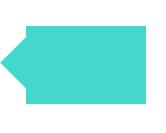  
**为了增强对话框的质感**，我对::before和t-box下添加以下代码  
```css
box-shadow: 1px 1px 5px rgba(0, 0, 0, .8);
```

遇到了一些问题（如图）：  
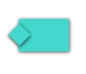  
box-shadow使得整个边框出现了阴影。即使z-index设置为2也无济于事。
（原因：受到了层叠上下文的影响，什么是层叠上下文这里就不做解释了，这又是前端的一个重要知识点。具体请看这篇文章[深入理解CSS中的层叠上下文和层叠顺序-张鑫旭](https://www.zhangxinxu.com/wordpress/2016/01/understand-css-stacking-context-order-z-index/)）  
解决办法：这时候**我们需要覆盖掉气泡上的阴影**，这时需要*添加一个新的元素*， 仍然引入::after伪元素。（可以直接把上面::before的代码，复制到::after里面，再进一步微调，代码如下：）  
```css
.t-box::after {
    position: absolute;
    top: 11px;
    left: -9px;
    content: "";
    border: 15px solid; 
    border-color: #44D7CD;
    transform: rotate(45deg);
    display: block;
}
```

注意：因为需要用::after覆盖::before的阴影，所以相应的把边框调大。把z-index的值调大，使其堆叠在最上方。最后调整position，把::after放到合适的位置。效果如图
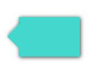  
我们对气泡对话框左侧的阴影进一步加深。把::before的最后一行代码改为
```
box-shadow: -2px 3px 9px rgba(0, 0, 0, .8);
```
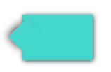 试比较两种效果  
如果想在对话框中，写入内容。但是，由于::after堆叠在最上方。我们需要在HTML中加入新标签，并把它的z-index调至最大，从而让内容覆盖::after。HTML代码如下：
```html
<div class="t-box">
    <div class="container">这是内容！
</div>
```
container的样式
```css
.container {
    position: relative;
    z-index: 9;
    background-color: #44D7CD;
    padding: 5px;
}
```

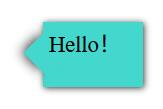

---
### 参考资料

1. 前沿科技温谦. CSS设计彻底研究. 人民邮电出版社 [豆瓣地址](https://book.douban.com/subject/2984164/)
2. Luckyzhoufangbing的博客 [如何在网页里面做一个带阴影三角形](https://blog.csdn.net/Luckyzhoufangbing/article/details/80192682)
3.  陈小峰（iefreer）的专栏 [如何使用纯CSS3创建一个简单的五角星图形](https://blog.csdn.net/iefreer/article/details/50718420)
4. VeinYin. [边框画的三角形给shadow](https://www.cnblogs.com/veinyin/p/8690882.html)
